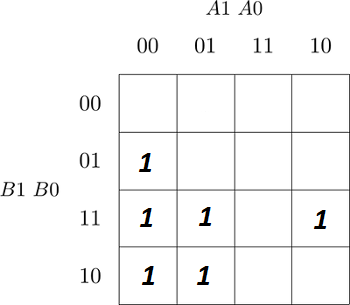
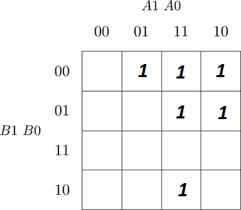
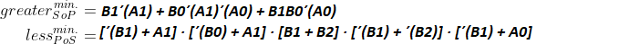

# Lab 2: Vilém Pecháček

### Preparation task

   | **Dec. equivalent** | **B[1:0]** | **A[1:0]** | **B is greater than A** | **B equals A** | **B is less than A** |
   | :-: | :-: | :-: | :-: | :-: | :-: |
   |  0 | 0 0 | 0 0 | 0 | 1 | 0 |
   |  1 | 0 0 | 0 1 | 0 | 0 | 1 |
   |  2 | 0 0 | 1 0 | 0 | 0 | 1 |
   |  3 | 0 0 | 1 1 | 0 | 0 | 1 |
   |  4 | 0 1 | 0 0 | 1 | 0 | 0 |
   |  5 | 0 1 | 0 1 | 0| 1 |  0|
   |  6 | 0 1 | 1 0 | 0 | 0 | 1 |
   |  7 | 0 1 | 1 1 | 0| 0 | 1 |
   |  8 | 1 0 | 0 0 | 1 | 0 | 0 |
   |  9 | 1 0 | 0 1 | 1 | 0 | 0 |
   | 10 | 1 0 | 1 0 | 0 | 1 | 0 |
   | 11 | 1 0 | 1 1 | 0 | 0 | 1 |
   | 12 | 1 1 | 0 0 | 1 | 0 | 0 |
   | 13 | 1 1 | 0 1 | 1 | 0 | 0 |
   | 14 | 1 1 | 1 0 | 1 | 0 | 0 |
   | 15 | 1 1 | 1 1 | 0 | 1 | 0 |
   
### 2-bit comparator

1. Karnaugh maps for other two functions:

   Greater than:

   

   Less than:

   

2. Equations of simplified SoP (Sum of the Products) form of the "greater than" function and simplified PoS (Product of the Sums) form of the "less than" function.

   

### 4-bit comparator

1. Listing of VHDL stimulus process from testbench file (`testbench.vhd`) with at least one assert (use BCD codes of your student ID digits as input combinations). Always use syntax highlighting, meaningful comments, and follow VHDL guidelines:

   Last two digits of my student ID: **xxxx26**

```vhdl
    --------------------------------------------------------
    -- Data generation process
    --------------------------------------------------------
    p_stimulus : process
    begin
        -- Report a note at the beginning of stimulus process
        report "Stimulus process started" severity note;

        -- First test case ...
        s_b <= "0010"; s_a <= "0110"; wait for 100 ns;--ID: xxxx26
        -- ... and its expected outputs
        assert ((s_B_greater_A = '0') and
                (s_B_equals_A  = '0') and
                (s_B_less_A    = '1'))
        -- If false, then report an error
        -- If true, then do not report anything
        report "Input combination 0010, 0110 FAILED" severity error;

        -- Report a note at the end of stimulus process
        report "Stimulus process finished" severity note;
        wait; -- Data generation process is suspended forever
    end process p_stimulus;
```

2. Text console screenshot during your simulation, including reports.

   

3. Link to your public EDA Playground example:

   [https://www.edaplayground.com/x/giWa](https://www.edaplayground.com/x/giWa)
